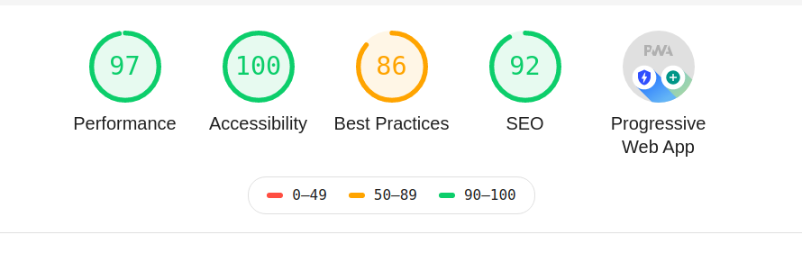
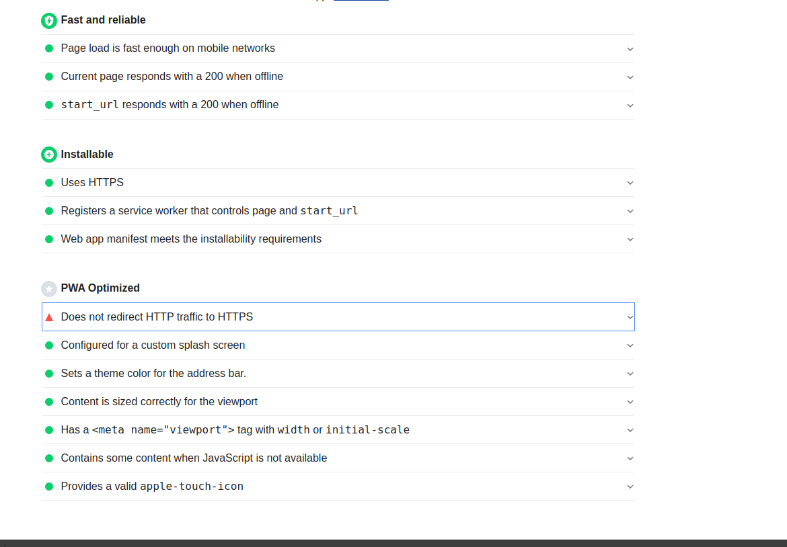

## IPL Dashboard

### Live Demo:
-  https://ipl-dashboard.web.app
-  https://ipl-dashboard.firebaseapp.com

## EDA Notebook
- https://nbviewer.jupyter.org/github/macabdul9/ipl-dashboard/blob/master/notebooks/exploratory-data-analysis.ipynb

### Major Libraries/Packges Used
EDA
- Python
- Pandas
- Seaborn
- Plotly
  
Web App
- reactjs
- material-ui
- chartjs 2
- google-map-react

## Bonus Points

### 1. Vue.js: **No**
- I feel comfortable with React.Js, although I am keen to learn Vui.js.

### 2. Optimized Loading Time : **Yes**
- 97 Lighthouse score
- Code splitting
- Reused components for different charts ie: All Pie charts in the web app are plotted by resuing single component, with the help of props and states.
- All states were UI related hence didn't feel the need of using middleware for state management. 
- Stored the data into local json file, analysis was perform using python in jupyter-lab notebook.
  
### 3. Mobile Responsive: **Yes**
- All visualization components are mobile responsive.
- Chartjs 2 and material-ui components are responsive.

### 4. PWA : **Yes**
- Uses HTTPS
- Created manifest.json file that meets the installability requirements.
- Custom splash screen, valid icons, and correct content size for viewport.

### 5. Offline usable: **Yes**
- Registers a service worker so that our web app can work offline.
- When offline start_url responds withing 200ms.

### Lighthouse Score is attached below:

